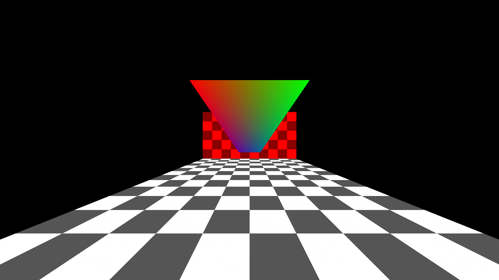

# SoftRenderer 项目导读

这是一个从三维数据到图片的完整小型渲染管线。程序用自己的向量、矩阵和光栅化代码计算像素，最后写出 PPM；图像不是调用 GPU 渲染 API 得到的。

## 运行后会看到什么

场景由棋盘地面、墙面和彩色三角形组成。摄像机和投影矩阵把场景变换到屏幕，重心坐标决定一个像素是否落在三角形内，深度缓冲决定前后遮挡。顶点颜色采用透视校正插值。



图为 2026-09-14 使用本仓代码实际生成的 3840×2160 PPM 转为 PNG，转换没有修改场景。运行一次生成一幅图，不是实时帧率演示。

## 三个值得解释的设计

1. **颜色与深度分开保存**：遮挡比较不依赖已经画出的颜色；清屏时同步重置深度。
2. **先变换再光栅化**：坐标系变换与像素覆盖各自有清晰输入，方便定位投影和插值错误。
3. **用 PPM 输出**：文件结构简单，便于观察原始结果；目前不包含窗口系统和交互相机。

当前实现不能被描述为完整图形引擎：没有完整纹理/材质、模型导入与编辑器；近裁剪平面相交三角形等边界仍值得继续完善。

## 代码路线

[main.cpp](../src/main.cpp) → [geometry.h](../include/geometry.h) → [rasterizer.cpp](../src/rasterizer.cpp) → [framebuffer.cpp](../src/framebuffer.cpp)。

先追踪一个三角形的顶点和齐次坐标，再追踪一个屏幕像素的重心权重和深度值，比从全部数学函数开始更容易理解。

## 本次验证

Windows、GCC 15.2、Release 构建通过；实际运行生成结果图。新增边界测试覆盖负下标、上边界、正常写读、清屏和零尺寸缓冲。GetDepth 越界分支缺 return 已修复；CMake 的 UTF-8 选项仅对 MSVC 生效。

```powershell
ctest --test-dir build -C Release --output-on-failure
```

[返回首页](../README.md)
